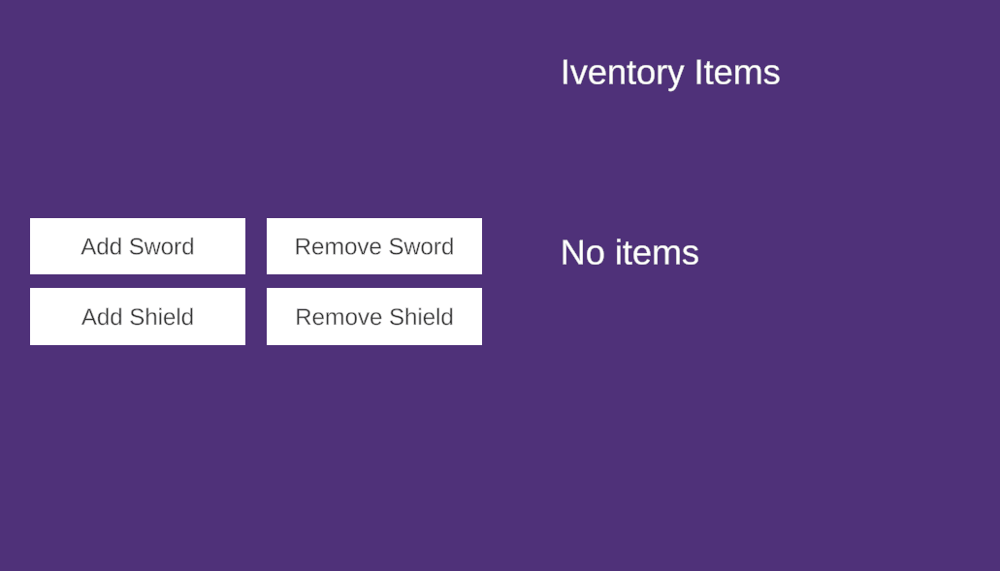
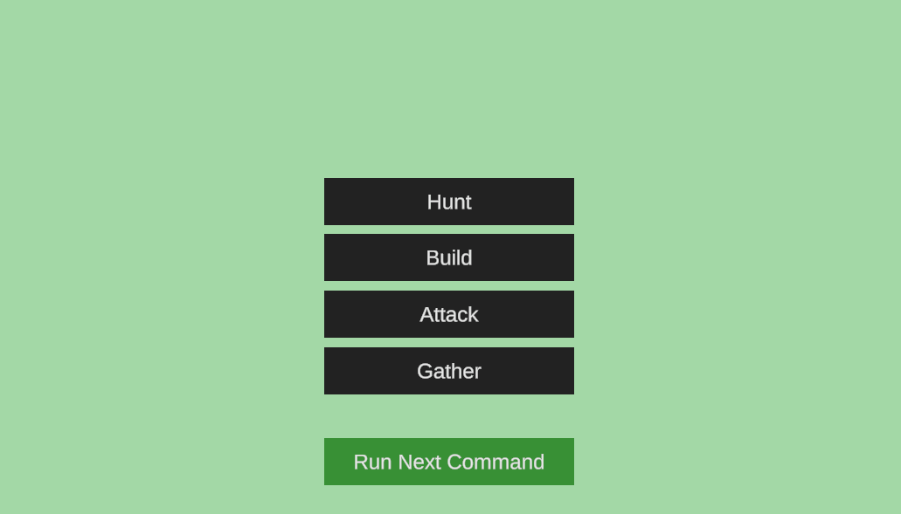
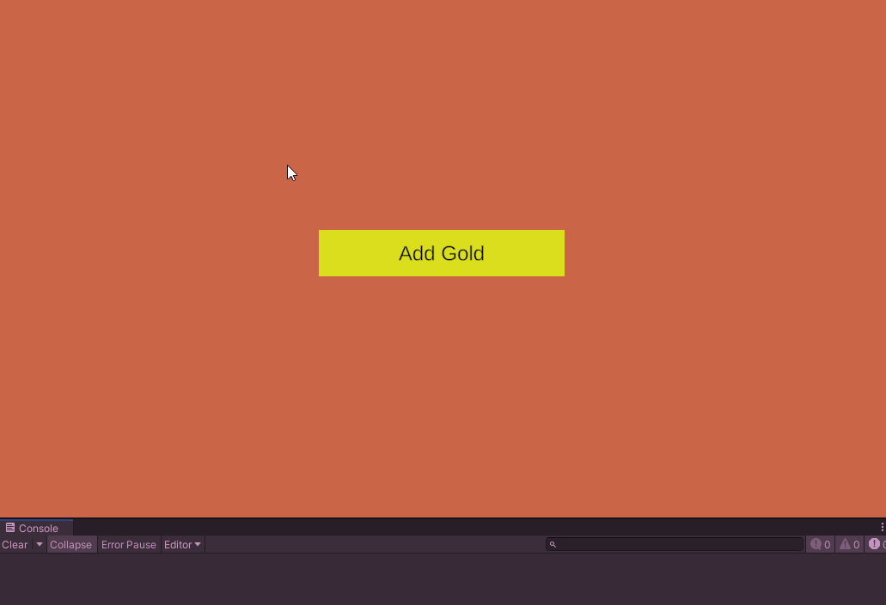
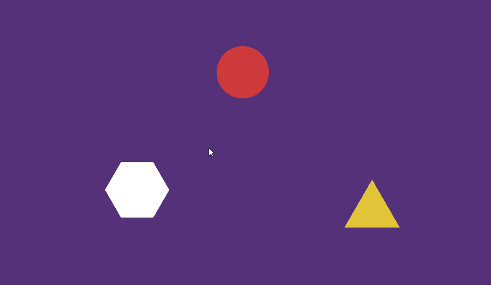

# Unity C# Techniques

This repository contains a collection of Unity C# techniques that I have learned and implemented.

## Dictionaries

Simple inventory system using a dictionary to store items and their quantities.

[Implementation](Assets/Scripts/Inventory.cs)

## Queues

Simple command manager using a queue to store commands.

[Implementation](Assets/Scripts/CommandManager.cs)

## Lambda Expressions

Simple button manager using Lambda expressions to add listeners to buttons.

[Implementation](Assets/Scripts/ButtonManager.cs)

## Interfaces

Simple interactable elements using an interface to interact with objects in the scene.

[Interface](Assets/Scripts/IInteractable.cs) & 
[Implementation](Assets/Scripts/ColorChanger.cs)